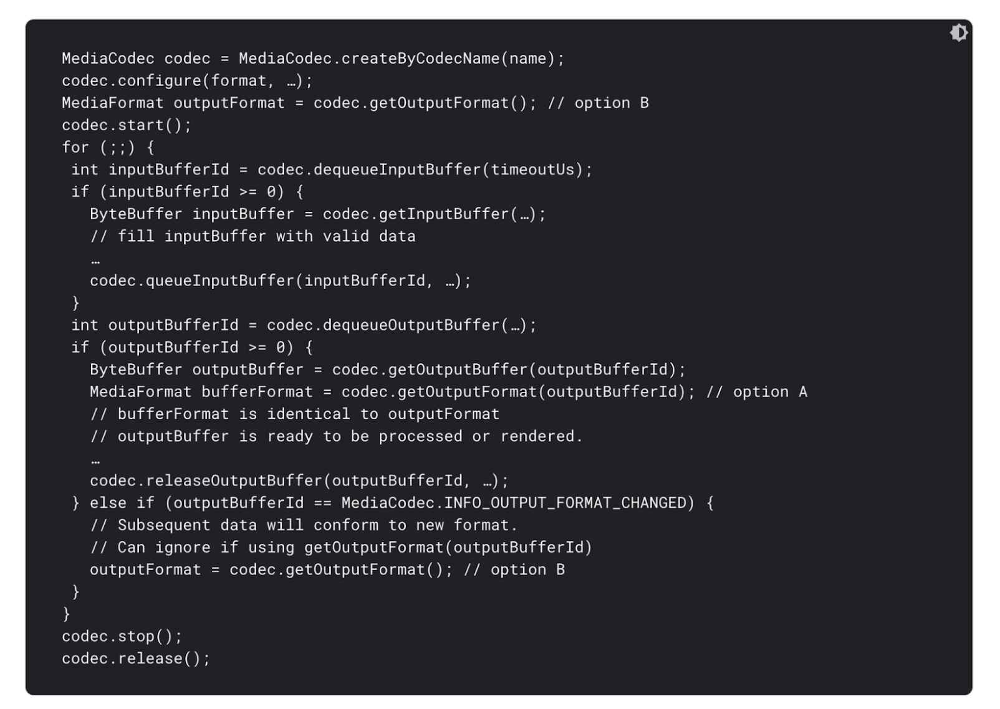
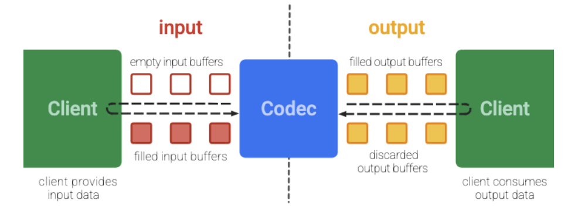
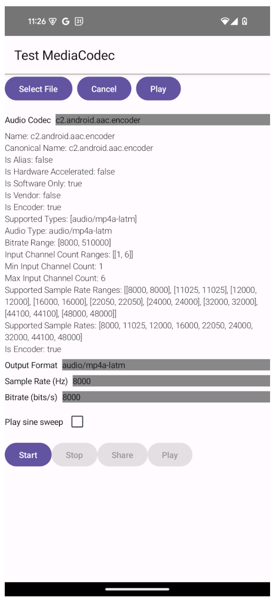
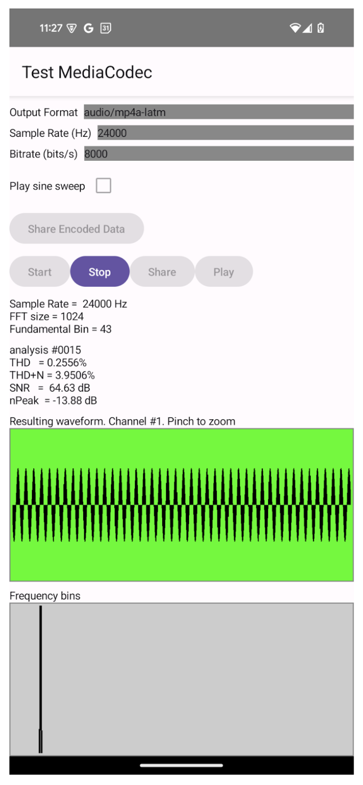
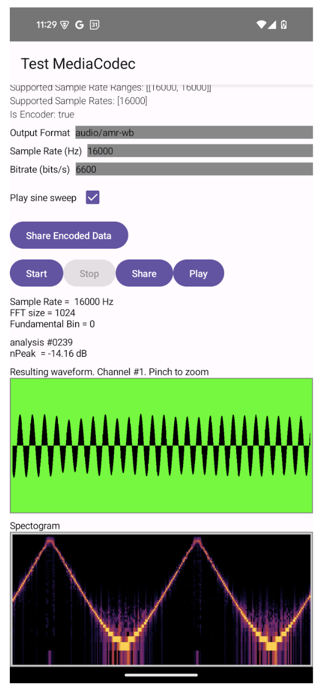
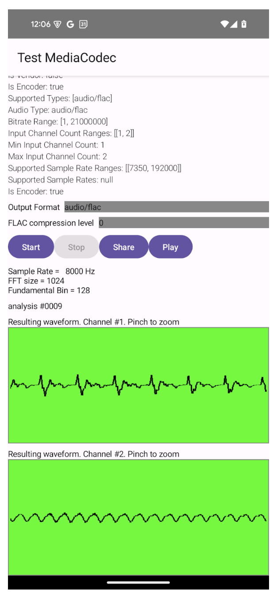

# MediaCodec Tests

## Summary

MediaCodec Tests lets you test encoding/decoding audio streams with various codecs and parameters.
You can encode a sine wave, a sine sweep, or from a file. You will be able to visualize the output
and get metrics for noise and distortion.

MediaCodec is the Java library used for encoding and decoding video and audio streams. We wanted
to focus on testing audio streams in this project. By using MediaCodec for both encoding and
decoding, we can feed audio data through the encoder and the decoder and analyze how much noise
or distortion is added by the codec.

Below is a diagram of a basic encoding/decoding pipeline.

## MediaCodec

MediaCodec can be used to encode data from PCM to OPUS, AAC, AMR-NR, etc. It can also be used to
decode data from OPUS, AAC, AMR-NR, etc to PCM. These are considered "buffer to buffer" as input
buffers get packaged to output buffers. Note that multiple input buffers may be used to create
an output buffer and vice-versa.

Below is a code block demonstrating how to create a MediaCodec.

The following steps happen.

1. A specific codec is picked from a list of available codecs.
2. The codec is configured with a format (sample rate, bitrate, channel count, etc)
3. The codec is started.
4. While there is available data to pass into the input buffer, enqueue the buffer.
5. If there is a buffer available in the output buffer, dequeue the buffer.
6. Once the data is complete, stop and release the codec.

Below is a diagram on how input buffers turn into output buffers.

For files, the BUFFER_FLAG_END_OF_STREAM flag can be used to signal the end of a stream. By
passing this flag when queuing the input buffer, when the same flag is received from the output
buffer, you can determine when to terminate the MediaCodec.

## Test Architecture

There are currently 3 ways of testing with MediaCodec

1. A sine wave is created and is passed through a MediaCodec encoder and a MediaCodec decoder
before going through a harmonic analyzer. This analyzer will show the total harmonic distortion
(THD), total harmonic distortion + noise (THD+N), signal noise ratio (SNR), and the peak decibels.
Since a sine wave is a sound only at one frequency, we expect the resulting frequency graph to have
one main peak. An FFT can have multiple small side peaks if the sine wave frequency is not centered
in a bin. A graph with frequency bins can be looked at to confirm this.
2. A sine sweep is created and is passed through a MediaCodec encoder and a MediaCodec decoder
before going through a harmonic analyzer. A spectrogram is created that helps uncover if certain
frequencies have distortions.
3. An input PCM file is used. The PCM audio is passed through the MediaCodec Encoder and the
MediaCodec decoder. Since this is an arbitrary file, there is limited information available besides
the output itself.

For all 3 ways of testing, these tests allow you to view the waveform that has been encoded and
decoded. This waveform can also be heard and exported. For certain codecs, the encoding only file
can be exported.

## Test parameters

Each phone has a set of supported audio codecs, some of which are encoders and some are decoders.
It seems that the list of supported audio codecs is generally a subset of the supported decoders.
Thus, if a codec can be used for encoding, it should be able to be used for decoding.

MediaCodec tests populate the list of available codecs and gives a set of options based on the
audio codec.

A codec may be an aliased to another name, hardware accelerated, software only, created by the
vendor, and an encoder or decoder. They have a specific supported output audio types with a list
of supported bitrates, input channels, and sample rates.

When a file is not selected, a single channel sine wave or sine sweep will be created. The encoding
sample rate and bitrate can be set. For FLAC, the compression level is an option instead of
bitrate.

When a file is selected, the channel count and sample rate will be based on the input file. Only
the compression level can be selected for FLAC and bitrate for other codecs.

## Sine Wave Tests

Sound-checker creates a sine wave of the certain sample rate and passes the PCM data through an
encoder and decoder. The Harmonic Analyzer calculates the fundamental bin and evaluates the
results. Each analysis comprises 1024 bins and gives a result for Total Harmonic Distortion (THD),
Total Harmonic Distortion + Noise (THD + N), Signal to Noise (SNR), and Peak Amplitude in decibels
(nPeak). Ideally, we would want lower THD and THD+N values and higher SNR and nPeak values.

A waveform of the final signal is also provided. This should ideally be a sine wave. The graph of
the frequency bins is shown with a gray background. The left bins represent lower frequencies and
the right bins represent higher frequencies. This is ideally a single vertical line, signaling
that the signal is all within one frequency bin.

## Sine Sweep Tests

Instead of encoding a sine wave, the sine sweep tests create a sine sweep by modulating the
frequency of the sine wave. The variable phase increment will result in a tone that increases and
decreases in pitch.

THD and other metrics no longer apply for sine sweep tests as the result should have multiple
frequency bins instead of one. Instead, we can look at a spectrogram to see which frequencies the
sine wave is in over time.

For a spectrogram, each vertical bar is the density of frequencies for a particular time frame. So
instead of frequency bins being in one graph in the sine wave graph, the frequency bins are mapped
to one line, with higher frequencies being higher. We should expect most data to be within the
correct signal bin, resulting in an appearance of hills.

## File Encoding Tests

Instead of encoding sine waves or sine sweeps, we can encode/decode from a WAV file instead. Since
files have built in sample rates and channel counts, these parameters are not settable.

You can export the resulting WAV and run a perceptual analyzer like VISQOL to analyze the data
loss.
